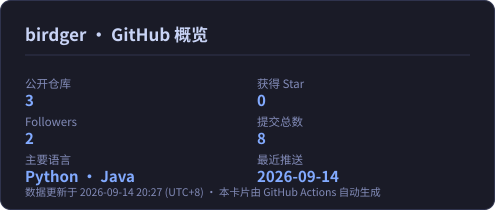

<div align="center">

<a href="https://github.com/birdger">

</a>

# Hi, I'm birdger 👋

**多模态推荐 · 大模型增强推荐(LLM4Rec) · 无人值守工程**

[](https://github.com/birdger?tab=followers)
[](https://github.com/birdger?tab=repositories)
[](https://github.com/birdger/daily-arxiv-digest)
[](https://github.com/birdger/daily-arxiv-digest/commits/main)
[](https://github.com/birdger)

</div>

---

## 🧭 关于我

```python
birdger = {
    "方向":   ["多模态推荐系统", "LLM 增强推荐 / LLM4Rec", "跨模态表示与融合"],
    "身份":   "在读研究生 · AI / 推荐系统",
    "手里在做": ["复现生成式推荐 / 序列推荐 / 多模态融合的代表性工作",
                 "验证 LLM 富化 × 多模态融合 对推荐效果的实证增益",
                 "维护一份每天自动更新的中文论文雷达"],
    "信条":   "任何能自动化的，绝不手动",
}
```

---

## 🚀 代表项目

| 项目 | 一句话 | 硬核点 |
|:---|:---|:---|
| 📡 **[daily-arxiv-digest](https://github.com/birdger/daily-arxiv-digest)** | 每天自动抓取 arXiv `cs.IR/CL/CV/MM/LG`，关键词加权打分，生成**中文论文日报**并自动提交 | 零成本跑在 GitHub Actions；**三层冗余**（云端 Actions + 本机计划任务 + 本地兜底脚本），抓取失败不写空日报、推送失败自动重试；连续 60 天无提交会自动失效的规则也考虑到了 |
| 🌿 **[bridge-bolg](https://github.com/birdger/bridge-bolg)** | 个人站点三合一：**博客 / 任务看板 / 知识库**，同一套纸感森林绿设计语言 | 前后端分离 + H2 持久化 + Markdown 双向链接；三端共用一套视觉规范与路由 |
| 🔁 **多平台代码同步** | GitHub 为主，**Gitee / AtomGit / 极狐 GitLab 三站辅**，每天自动同步 | 四站内容以**提交哈希逐字校验**（不是"看着像"）；平台不支持 API 的场景改用本地推送 / 平台镜像拉取自动兜底 |
| 🧰 **[birdger](https://github.com/birdger/birdger)** | 你正在看的这个主页 | README 由**自动流水线维护**，每日无人干预更新 |

---

## 📡 旗舰：每日中文论文雷达

> 早上一睁眼，`cs.IR / cs.CL / cs.CV / cs.MM / cs.LG` 的新论文已经按主题打好分、翻成中文、排好序躺在仓库里。

[](https://github.com/birdger/daily-arxiv-digest/actions/workflows/daily.yml)

---

## 🛠 技术栈

**AI / 推荐**


**工程 / 自动化**


**科研工具**


---

## 📊 数据面板

<div align="center">

<!-- 这张卡片由仓库内的脚本每天自动重绘（assets/stats.svg），不依赖任何第三方服务 -->


</div>

---

## 🔄 多平台同步

**GitHub 是唯一源头，其余三站自动跟随。**

| 平台 | 地址 | 同步方式 |
|:---|:---|:---|
| 🐙 GitHub | [github.com/birdger](https://github.com/birdger) | **主仓库**（源头） |
| 🟠 Gitee | [gitee.com/ou-lingqiao](https://gitee.com/ou-lingqiao) | 本地推送 + 每日任务 |
| 🧩 AtomGit | [gitcode.com/OuGod](https://gitcode.com/OuGod) | 平台镜像自动拉取 |
| 🦊 极狐 GitLab | [jihulab.com/birdger](https://jihulab.com/birdger) | 本地推送 + 每日任务 |

<sub>四站 `main` 分支的提交哈希保持一致，每天自动校验。</sub>

---

## ⚙️ 无人值守流水线

```text
06:17  GitHub Actions     抓 arXiv → 打分 → 生成中文日报 → 提交（云端，不受本机开关机影响）
07:05  Windows 计划任务    检查当日是否已有产出 → 缺则补跑 → 同步三站辅助平台
07:05  ⏰ 定时汇报         汇总当日结果并推送通知
├─ 失败降级：抓取全挂 → 不写空日报；推送失败 → 自动重试；错过时间 → 开机自动补跑
└─ 凭据安全：凭据只存本机凭据管理器，自动化全程不弹窗、不交互
```

---

<div align="center">


<sub>本页由自动化流水线维护 · 每日更新 · 数据以仓库提交记录为准</sub>

</div>
